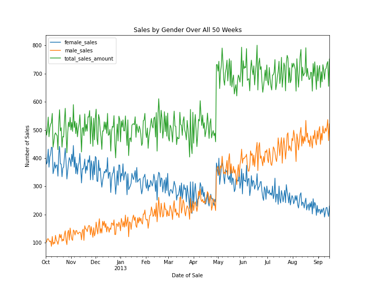
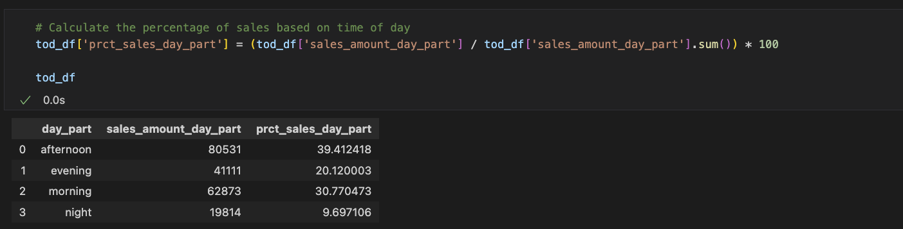

# Sales Data Analysis - 23&Me
**Purpose**
To analyze a dataset containing 50 weeks worth of purchases at 23&Me. 

## Resources
[datasets.zip](/resources/datasets.zip) - Contains 50 weeks of 23&Me purchase data

## Deliverable 1: Plot daily sales for all 50 weeks.

## Deliverable 2: What date did the sudden change in sales occur?
To determine the date the change in sales occurred, I created a column that calculates the difference between the current day's sales and that of the previous. Then I determined the row/date where the max change occurred (2013-04-29).

## Deliverable 3: Is the change in daily sales at the date you selected statistically significant?
The change in daily sales at 2013-04-29 was compared to the sales amount from all other sales. It was statistically significant (p-value 4.5*10^-85).

## Deliverable 4: Does the data suggest that the change in daily sales is due to a shift in the proportion of male-vs-female customers?

## Deliverable 5: What is the percentage of sales in each daypart over all 50 weeks?
Assume a given day is divided into four dayparts:

night (12:00AM - 6:00AM),

morning (6:00AM - 12:00PM),

afternoon (12:00PM - 6:00PM),

evening (6:00PM - 12:00AM).

A function was created to break the day into "night", "morning", "afternoon", and "evening" time frames. Then the total sales for each part of the day was calculated across all 50 weeks.

